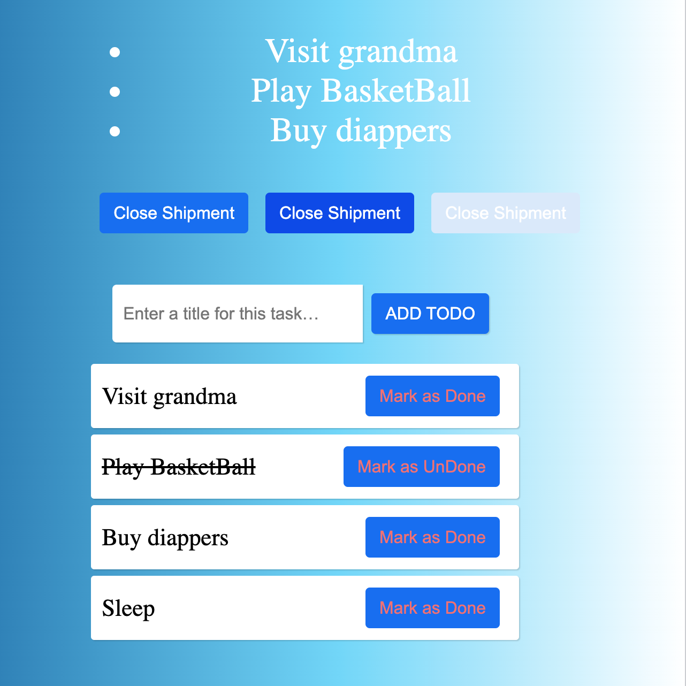

# ZenSmart React Test
- Todo list
- Large buttons

## Instalation instractions
```
- git clone https://github.com/biolabalo/ZenSmart.git
- cd ZenSmart
- yarn install
- yarn start 
```

## Buttons component guideline 
**Component Use** : `<LargeButton />` or `<LargeButton></LargeButton>` <br>
**Props list** : 
| Props         | Posible values                                        |
| ------------: | :---------------------------------------------------- |
| text          | To display button text                                |
| bgcolor       | `#0a69f4` `#0242eb` `#d9e9fb`                            |


## Screenshots
